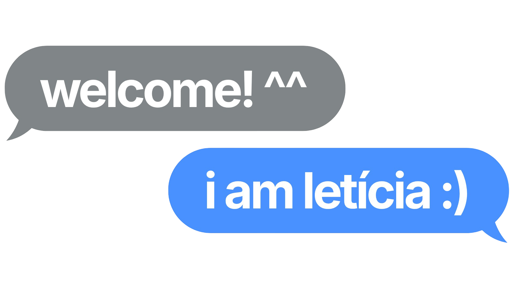
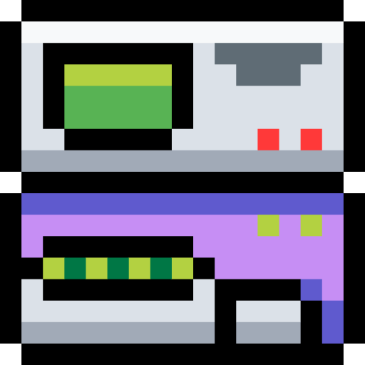
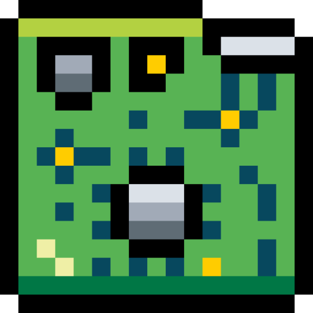
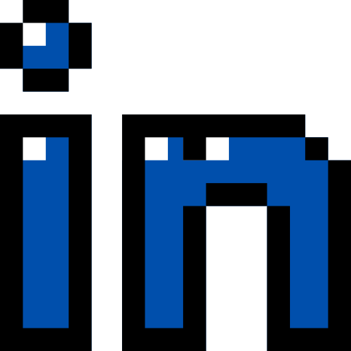

    

##  about me:

    i'm a systems analysis and development student passionate about technology and always looking to learn something new! 
    currently, i'm improving my programming and software development skills through studies and personal projects.
      
     &nbsp; interested in software development and backend technologies 
     &nbsp; exploring data, automation and artificial intelligence 
     &nbsp; learning by building and solving problems 

##  technologies i'm studying:

 

&nbsp;&nbsp;

&nbsp;&nbsp;

&nbsp;&nbsp;

&nbsp;&nbsp;

&nbsp;&nbsp;

&nbsp;&nbsp;

&nbsp;&nbsp;

  

##  social media:
 &nbsp; [instagram](https://www.instagram.com/ticiaalm/) 
 &nbsp; [e-mail](mailto:leticiaalmeidadev@gmail.com) 
 &nbsp; [linkedin](https://www.linkedin.com/in/ticiaalm/)

##
#### thank you for visiting my profile! i'm always open to collaboration and new opportunities in the technology field. 